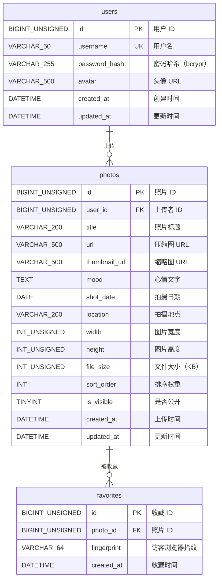

# 光影手记 / SNAPSHOT — 数据库设计文档

## 一、概述

- **数据库名称**：`shimmer`
- **字符集**：`utf8mb4`（支持完整 Unicode，含 emoji）
- **排序规则**：`utf8mb4_unicode_ci`
- **存储引擎**：InnoDB（支持事务和外键）

## 二、ER 关系图

## 三、表结构详解

### 3.1 `users` — 管理员用户表

| 字段 | 类型 | 约束 | 说明 |
|------|------|------|------|
| `id` | BIGINT UNSIGNED | PK, AUTO_INCREMENT | 用户 ID |
| `username` | VARCHAR(50) | NOT NULL, UNIQUE | 用户名，用于登录 |
| `password_hash` | VARCHAR(255) | NOT NULL | bcrypt 密码哈希 |
| `avatar` | VARCHAR(500) | NULL | 头像 URL |
| `created_at` | DATETIME | NOT NULL, DEFAULT NOW | 创建时间 |
| `updated_at` | DATETIME | NOT NULL, ON UPDATE | 自动更新时间 |

**索引**：
- `PRIMARY KEY` (`id`)
- `UNIQUE KEY` (`username`)

**说明**：当前系统仅设管理员角色，未来如需扩展多角色（编辑、访客注册等），可在此表增加 `role` 字段。

---

### 3.2 `photos` — 照片表

| 字段 | 类型 | 约束 | 说明 |
|------|------|------|------|
| `id` | BIGINT UNSIGNED | PK, AUTO_INCREMENT | 照片 ID |
| `user_id` | BIGINT UNSIGNED | NOT NULL, FK → users.id | 上传者（管理员） |
| `title` | VARCHAR(200) | NULL | 照片标题 |
| `url` | VARCHAR(500) | NOT NULL | 压缩后图片 URL（200-500KB） |
| `thumbnail_url` | VARCHAR(500) | NULL | 缩略图 URL（列表展示用） |
| `original_url` | VARCHAR(500) | NULL | 原始未压缩图片 URL（可选备份） |
| `mood` | TEXT | NULL | 心情文字（一句话日记） |
| `shot_date` | DATE | NULL | 拍摄日期（时间轴排序用） |
| `location` | VARCHAR(200) | NULL | 拍摄地点 |
| `width` | INT UNSIGNED | NULL | 图片宽度 px（瀑布流布局计算） |
| `height` | INT UNSIGNED | NULL | 图片高度 px（瀑布流布局计算） |
| `file_size` | INT UNSIGNED | NULL | 压缩后文件大小 KB |
| `sort_order` | INT | DEFAULT 0 | 手动排序权重，越大越靠前 |
| `is_visible` | TINYINT(1) | NOT NULL, DEFAULT 1 | 1=公开，0=隐藏（草稿） |
| `created_at` | DATETIME | NOT NULL, DEFAULT NOW | 上传时间 |
| `updated_at` | DATETIME | NOT NULL, ON UPDATE | 自动更新时间 |

**索引**：
| 索引名 | 字段 | 用途 |
|--------|------|------|
| `idx_user_id` | `user_id` | 按上传者查询 |
| `idx_is_visible` | `is_visible` | 过滤公开/隐藏照片 |
| `idx_sort_order` | `sort_order` | 手动排序查询 |
| `idx_created_at` | `created_at` | 时间轴排序 |
| `idx_shot_date` | `shot_date` | 按拍摄日期排序 |
| `idx_visible_created` | `(is_visible, created_at)` | 首页查询：公开照片 + 上传时间排序 |
| `idx_visible_sort` | `(is_visible, sort_order)` | 首页查询：公开照片 + 手动排序 |

**外键**：
- `fk_photos_user_id`：`user_id` → `users.id`（级联删除、更新）

**说明**：
- `url` 存储经过 Sharp 压缩后的图片路径（200-500KB），用于详情页展示
- `thumbnail_url` 存储进一步缩小的缩略图，用于列表/网格页快速加载
- `original_url` 可选，存储原始未压缩图片，用于需要高清大图的场景
- `width`/`height` 供前端瀑布流布局计算列宽和行高
- `sort_order` 为 0 时表示使用默认排序（上传时间），非 0 值用于管理员手动置顶

---

### 3.3 `favorites` — 访客收藏表

| 字段 | 类型 | 约束 | 说明 |
|------|------|------|------|
| `id` | BIGINT UNSIGNED | PK, AUTO_INCREMENT | 收藏 ID |
| `photo_id` | BIGINT UNSIGNED | NOT NULL, FK → photos.id | 照片 ID |
| `fingerprint` | VARCHAR(64) | NOT NULL | 访客浏览器指纹（匿名标识） |
| `created_at` | DATETIME | NOT NULL, DEFAULT NOW | 收藏时间 |

**索引**：
| 索引名 | 字段 | 用途 |
|--------|------|------|
| `uk_photo_fingerprint` | `(photo_id, fingerprint)` | 联合唯一：同一访客不能重复收藏同一照片 |
| `idx_fingerprint_created` | `(fingerprint, created_at)` | 按访客查询收藏列表并按时间排序 |

**外键**：
- `fk_favorites_photo_id`：`photo_id` → `photos.id`（级联删除、更新）

**说明**：
- 收藏功能面向未登录访客，使用浏览器指纹（如 FingerprintJS 生成的 hash）标识用户
- 联合唯一约束 `uk_photo_fingerprint` 保证同一指纹对同一照片只能收藏一次
- 照片被删除时，关联收藏记录自动级联删除

## 四、典型查询场景与索引覆盖

| 场景 | SQL 示例 | 使用索引 |
|------|----------|----------|
| 首页照片网格（随机） | `SELECT * FROM photos WHERE is_visible=1 ORDER BY RAND() LIMIT 12` | `idx_is_visible` |
| 时间轴浏览 | `SELECT * FROM photos WHERE is_visible=1 ORDER BY shot_date DESC` | `idx_visible_created` 或 `idx_shot_date` |
| 手动排序展示 | `SELECT * FROM photos WHERE is_visible=1 ORDER BY sort_order DESC` | `idx_visible_sort` |
| 随机日记（随机一张） | `SELECT * FROM photos WHERE is_visible=1 ORDER BY RAND() LIMIT 1` | `idx_is_visible` |
| 访客收藏列表 | `SELECT p.* FROM favorites f JOIN photos p ON f.photo_id=p.id WHERE f.fingerprint=? ORDER BY f.created_at DESC` | `idx_fingerprint_created` |
| 判断是否已收藏 | `SELECT 1 FROM favorites WHERE photo_id=? AND fingerprint=?` | `uk_photo_fingerprint` |

## 五、文件位置

| 文件 | 路径 | 说明 |
|------|------|------|
| 建表脚本 | `server/database/schema.sql` | DDL + 索引 + 外键 |
| 种子数据 | `server/database/seed.sql` | 默认管理员账号 |

### 默认管理员账号

| 字段 | 值 |
|------|------|
| 用户名 | `admin` |
| 密码 | `admin123` |
