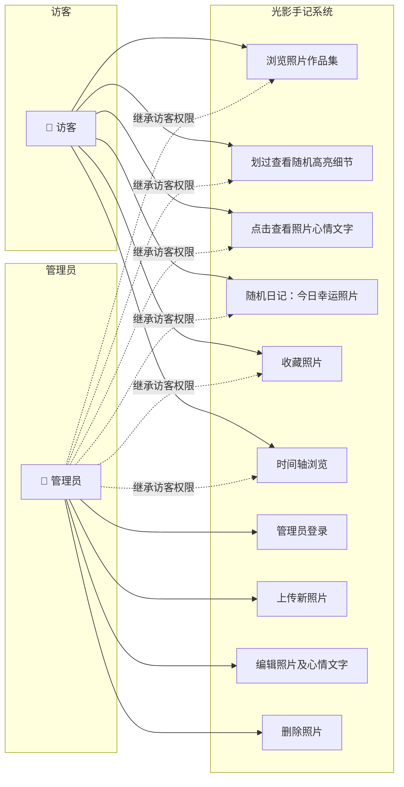
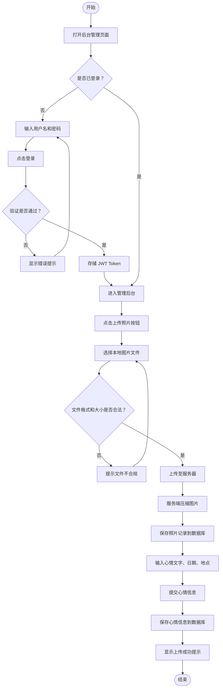
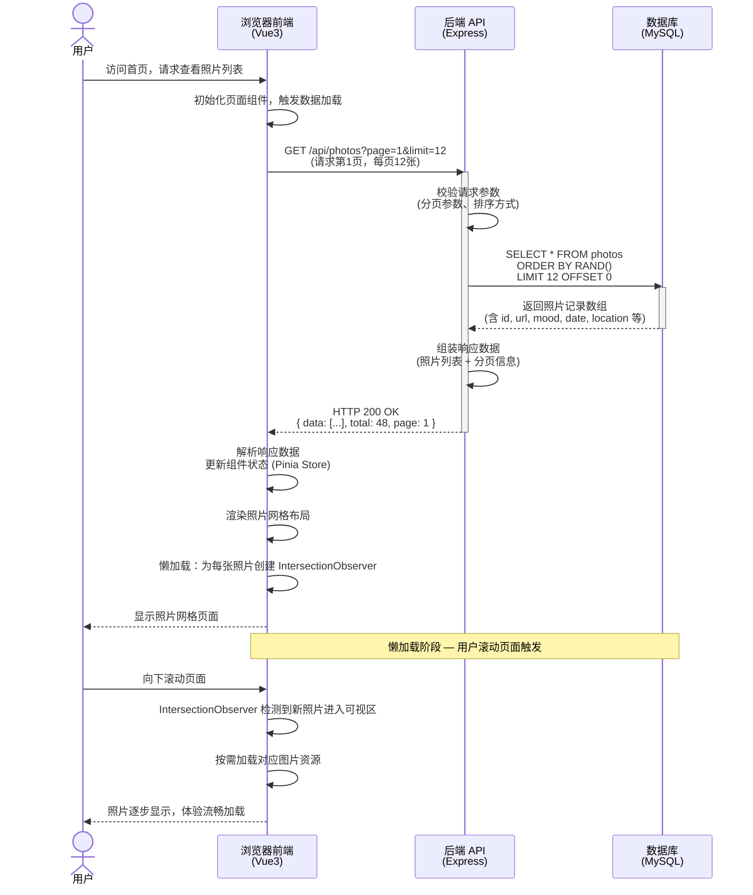

# 光影手记 / SNAPSHOT — 项目需求分析与 UML 建模

## 一、项目概述

### 1.1 项目名称

**光影手记 / SNAPSHOT**

### 1.2 核心目标

打造一个像随手翻开的日记本一样的个人摄影空间，让每一张照片都成为"时间的容器"，在随机的光影交互中给观看者带来即时的、故事性的双重惊喜。

### 1.3 技术栈

| 层级       | 技术选型                   | 说明                   |
| ---------- | -------------------------- | ---------------------- |
| 前端       | Vue3 + TypeScript + Vite   | 组合式 API，类型安全   |
| 后端       | Node.js + Express          | RESTful API 服务       |
| 数据库     | MySQL 8.x                  | 关系型数据存储         |
| 认证       | JWT (jsonwebtoken)         | 管理员登录鉴权         |
| 图片处理   | Sharp                      | 服务端图片压缩         |

### 1.4 核心用户角色

| 角色               | 描述                                       |
| ------------------ | ------------------------------------------ |
| **访客**           | 未登录的普通浏览者，可浏览所有公开内容       |
| **管理员（博主）** | 拥有后台管理权限，可对照片及内容进行增删改查 |

### 1.5 角色核心诉求

| 角色               | 核心诉求                                                                                   |
| ------------------ | ------------------------------------------------------------------------------------------ |
| **访客**           | 浏览照片作品集，通过鼠标划过发现照片中隐藏的细节，点击查看照片背后的心情故事                 |
| **管理员（博主）** | 便捷地登录后台，上传/编辑/删除照片及心情文字，管理作品展示顺序，打造个性化的摄影日记空间     |

---

## 二、功能性需求

### 2.1 摄影作品展示（前台核心）

| 编号 | 功能名称       | 功能描述                                                                                     |
| ---- | -------------- | -------------------------------------------------------------------------------------------- |
| F-01 | 照片网格展示   | 首页以优雅的瀑布流/网格形式展示所有照片，每次刷新页面照片顺序随机排列                       |
| F-02 | 划过随机高亮   | 鼠标在照片上划过时，照片上出现一个光晕区域，随机高亮照片的某个局部细节（暗房手电筒效果）     |
| F-03 | 照片详情查看   | 点击照片弹出详情卡片，显示心情文字（一句话日记）、拍摄日期、拍摄地点                         |
| F-04 | 过渡动画       | 照片加载、鼠标划过、点击弹出详情时均有柔和的过渡动画效果                                     |
| F-05 | 懒加载         | 照片按需加载，滚动到可视区域时才加载图片资源，减少首屏等待时间                               |

### 2.2 照片管理（后台）

| 编号 | 功能名称       | 功能描述                                                                                     |
| ---- | -------------- | -------------------------------------------------------------------------------------------- |
| F-06 | 管理员登录     | 管理员通过用户名和密码登录后台管理系统，登录成功后获取 JWT Token 用于接口鉴权                |
| F-07 | 照片上传       | 支持上传图片文件，服务端自动进行图片压缩优化，将图片存储至服务器并记录数据库                  |
| F-08 | 心情文字编辑   | 为每张照片添加/编辑一段心情文字，可选填拍摄日期和地点                                        |
| F-09 | 照片编辑       | 修改已上传照片的信息，支持替换照片文件                                                       |
| F-10 | 照片删除       | 删除已上传的照片及其关联的心情文字信息                                                       |

### 2.3 浏览模式

| 编号 | 功能名称       | 功能描述                                                                                     |
| ---- | -------------- | -------------------------------------------------------------------------------------------- |
| F-11 | 时间轴视图     | 按拍摄时间顺序浏览照片，呈现日记本翻阅感                                                     |
| F-12 | 随机日记       | "今日幸运照片"功能按钮，点击后随机展示一张照片及其心情故事                                   |
| F-13 | 收藏精选       | 访客可标记喜欢的照片，形成个人精选集，方便回顾                                               |

### 2.4 数据接口

| 编号 | 功能名称       | 功能描述                                                                                     |
| ---- | -------------- | -------------------------------------------------------------------------------------------- |
| F-14 | RESTful API    | 提供照片 CRUD 接口、管理员认证接口、收藏管理接口，前后端通过 JSON 格式交互                   |

---

## 三、非功能性需求

| 维度         | 需求描述                                                                                                       |
| ------------ | -------------------------------------------------------------------------------------------------------------- |
| **性能**     | 首页加载时间 < 2秒；单张照片压缩至 200KB-500KB；支持图片懒加载，按需加载资源；支持 CDN 加速（可选）             |
| **安全性**   | 管理员登录采用 JWT Token 鉴权，保护后台管理接口；图片上传进行格式（jpg/png/webp）和大小校验，防止恶意文件上传     |
| **易用性**   | 响应式设计适配移动端（移动端划过高亮改为点击触发）；暖色调/胶片感 UI 风格，字体选用手写体或衬线体               |
| **可维护性** | 前后端分离架构，RESTful API 设计，模块化代码组织，便于后续功能扩展和维护                                       |

---

## 四、UML 建模

### 4.1 用例图

下图展示了系统的用户角色（访客、管理员）及其与各功能用例之间的关系：

### 4.2 活动图

下图描述了 **"管理员登录后上传一张新照片并添加心情文字"** 的完整业务流程：

### 4.3 时序图

下图描述了 **"前端页面从后端获取并显示照片数据列表"** 的完整交互过程，包含用户、浏览器前端、后端 API、数据库四个参与者：

---

## 五、附录

### 5.1 核心交互设计说明

**惊喜一：划过浮现细节（随机区域高亮）**

- 鼠标在照片上划过时，照片上出现一个圆形或方形光晕区域跟随鼠标
- 该区域随机高亮照片的某个局部细节（非精确跟随鼠标位置），效果如同在暗房中用手电筒随机照亮照片的某个角落
- 实现思路：将照片划分为 N×M 虚拟网格，鼠标划过时随机选中一个网格区域叠加半透明白色光晕

**惊喜二：点击出现心情文字**

- 点击照片后弹出详情卡片或从底部滑出半透明面板
- 显示拍摄时的心情文字、日期、地点
- 文字风格模拟手写在日记本上的笔迹

### 5.2 数据库核心表设计（概要）

| 表名       | 主要字段                                                       |
| ---------- | -------------------------------------------------------------- |
| `users`    | id, username, password_hash, created_at                        |
| `photos`   | id, url, thumbnail_url, mood, date, location, created_at       |
| `favorites`| id, photo_id, session_id/fingerprint, created_at               |
