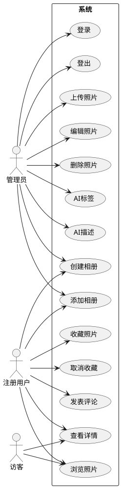
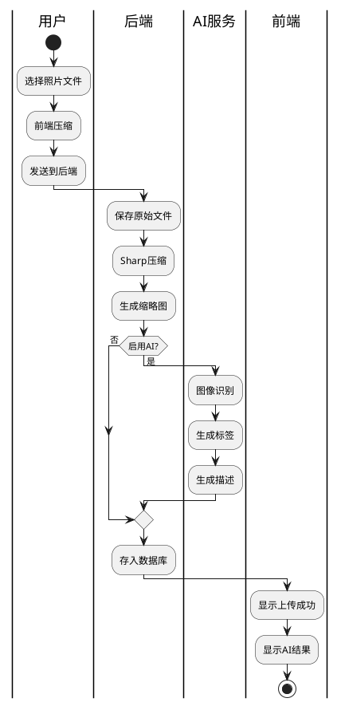
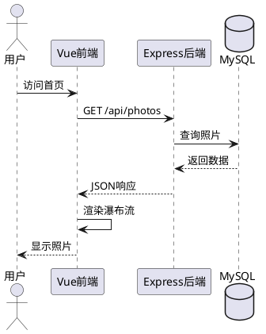
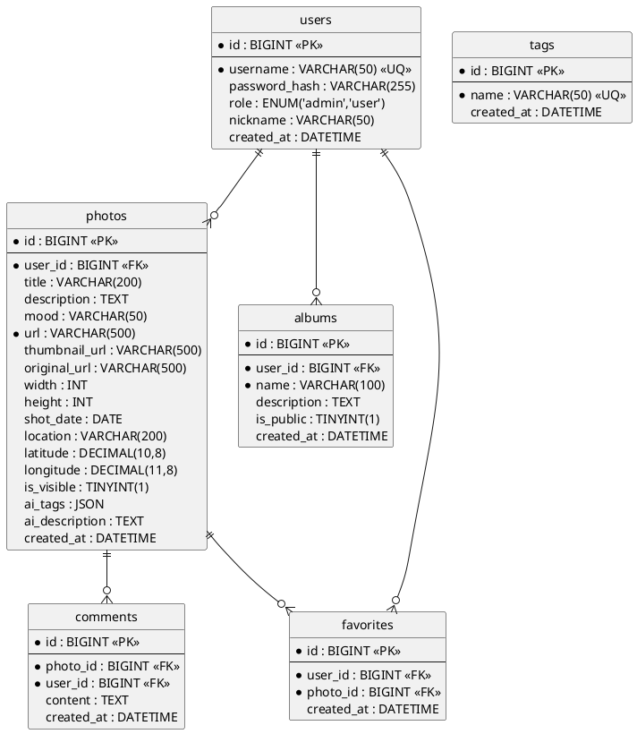
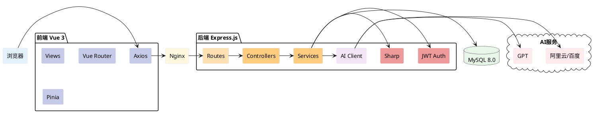
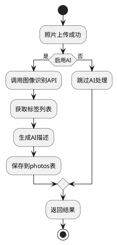

# 光影手记（Shimmer）项目分析与系统设计文档

---

## 1 项目概述

### 1.1 项目主题

**光影手记（Shimmer）** 是一款基于 Web 的个人照片日记应用，旨在帮助用户用照片记录生活中的每一个光影瞬间。

### 1.2 核心目标

- 提供美观、沉浸式的照片浏览体验
- 支持照片批量上传、自动压缩与智能标签
- 集成AI能力，自动识别照片内容并生成描述
- 为访客提供照片浏览、收藏与分享功能

### 1.3 核心业务流程

```
管理员: 登录 → 上传照片 → AI分析 → 编辑完善 → 发布公开
访客:   浏览瀑布流 → 查看详情 → 收藏/分享 → AI推荐
```

### 1.4 主要参与者

| 角色 | 描述 | 权限 |
|------|------|------|
| 管理员 | 照片上传者 | 登录、增删改照片、管理相册、AI配置 |
| 注册用户 | 登录访客 | 收藏、评论、创建收藏夹 |
| 访客 | 未登录用户 | 浏览公开照片、查看详情 |

### 1.5 项目特色功能

1. **AI智能标签**：自动识别照片中的物体、场景
2. **AI描述生成**：自动生成照片描述文字
3. **暗房模式**：沉浸式暗色背景浏览
4. **时间线视图**：按拍摄日期顺序回顾
5. **瀑布流展示**：自适应网格布局

---

## 2 需求分析

### 2.1 功能需求

#### 2.1.1 用户认证模块

| 功能 | 描述 | 优先级 |
|------|------|--------|
| 用户登录 | 管理员登录系统 | P0 |
| 用户登出 | 清除登录状态 | P0 |
| 修改密码 | 修改登录密码 | P1 |
| 用户注册 | 访客注册成为用户 | P2 |

#### 2.1.2 照片管理模块

| 功能 | 描述 | 优先级 |
|------|------|--------|
| 照片列表 | 分页获取照片列表 | P0 |
| 照片详情 | 获取单张照片详情 | P0 |
| 上传照片 | 上传新照片，自动压缩 | P0 |
| 编辑照片 | 修改照片信息 | P0 |
| 删除照片 | 删除照片及资源 | P0 |
| 批量上传 | 一次上传多张照片 | P1 |
| AI自动标签 | 上传时自动识别生成标签 | P1 |
| AI描述生成 | 自动生成照片描述 | P1 |

#### 2.1.3 照片展示模块

| 功能 | 描述 | 优先级 |
|------|------|--------|
| 瀑布流展示 | 网格布局展示照片 | P0 |
| 时间线视图 | 按日期顺序展示 | P0 |
| 暗房模式 | 暗色背景沉浸浏览 | P0 |
| 照片详情页 | 查看大图和详情 | P0 |

#### 2.1.4 收藏模块

| 功能 | 描述 | 优先级 |
|------|------|--------|
| 添加收藏 | 收藏喜欢的照片 | P0 |
| 取消收藏 | 取消已收藏的照片 | P0 |
| 收藏列表 | 查看收藏的照片 | P0 |
| 创建收藏夹 | 创建个人收藏夹 | P1 |

#### 2.1.5 相册管理模块

| 功能 | 描述 | 优先级 |
|------|------|--------|
| 创建相册 | 创建新相册 | P1 |
| 相册列表 | 查看所有相册 | P1 |
| 添加到相册 | 将照片添加到相册 | P1 |
| 相册详情 | 查看相册内照片 | P1 |

#### 2.1.6 评论模块

| 功能 | 描述 | 优先级 |
|------|------|--------|
| 发表评论 | 对照片发表评论 | P1 |
| 评论列表 | 查看照片评论 | P1 |
| 删除评论 | 删除自己的评论 | P1 |

### 2.2 非功能性需求

| 需求类型 | 目标 |
|----------|------|
| 性能 | 页面加载 < 2秒，图片懒加载 |
| 可用性 | 响应式设计，适配移动端 |
| 安全性 | bcrypt加密，JWT认证 |
| 可维护性 | 前后端分离，模块化设计 |

---

## 3 系统设计

### 3.1 UML建模

#### 3.1.1 用例图



#### 3.1.2 核心活动图——照片上传与AI处理



#### 3.1.3 核心时序图——浏览照片流程



### 3.2 数据库设计

#### 3.2.1 E-R图



#### 3.2.2 逻辑模型

| 表名 | 字段 | 类型 | 说明 |
|------|------|------|------|
| **users** | id | BIGINT | 主键 |
| | username | VARCHAR(50) | 用户名 |
| | password_hash | VARCHAR(255) | 密码哈希 |
| | role | ENUM | 角色 |
| | nickname | VARCHAR(50) | 昵称 |
| | created_at | DATETIME | 创建时间 |
| **photos** | id | BIGINT | 主键 |
| | user_id | BIGINT | 外键→users |
| | title | VARCHAR(200) | 标题 |
| | description | TEXT | 描述 |
| | mood | VARCHAR(50) | 心情 |
| | url | VARCHAR(500) | 压缩图URL |
| | thumbnail_url | VARCHAR(500) | 缩略图URL |
| | original_url | VARCHAR(500) | 原图URL |
| | width | INT | 宽度 |
| | height | INT | 高度 |
| | shot_date | DATE | 拍摄日期 |
| | location | VARCHAR(200) | 地点 |
| | latitude | DECIMAL | 纬度 |
| | longitude | DECIMAL | 经度 |
| | is_visible | TINYINT(1) | 是否公开 |
| | ai_tags | JSON | AI标签 |
| | ai_description | TEXT | AI描述 |
| | created_at | DATETIME | 创建时间 |
| **tags** | id | BIGINT | 主键 |
| | name | VARCHAR(50) | 标签名 |
| | created_at | DATETIME | 创建时间 |
| **albums** | id | BIGINT | 主键 |
| | user_id | BIGINT | 外键→users |
| | name | VARCHAR(100) | 相册名 |
| | description | TEXT | 描述 |
| | is_public | TINYINT(1) | 是否公开 |
| | created_at | DATETIME | 创建时间 |
| **favorites** | id | BIGINT | 主键 |
| | user_id | BIGINT | 外键→users |
| | photo_id | BIGINT | 外键→photos |
| | created_at | DATETIME | 收藏时间 |
| **comments** | id | BIGINT | 主键 |
| | photo_id | BIGINT | 外键→photos |
| | user_id | BIGINT | 外键→users |
| | content | TEXT | 评论内容 |
| | created_at | DATETIME | 评论时间 |

#### 3.2.3 物理模型（MySQL建表SQL）

```sql
-- 光影手记 数据库建表脚本 v3.0

CREATE DATABASE IF NOT EXISTS shimmer
  DEFAULT CHARACTER SET utf8mb4
  DEFAULT COLLATE utf8mb4_unicode_ci;

USE shimmer;

SET FOREIGN_KEY_CHECKS = 0;
DROP TABLE IF EXISTS comments;
DROP TABLE IF EXISTS favorites;
DROP TABLE IF EXISTS albums;
DROP TABLE IF EXISTS photos;
DROP TABLE IF EXISTS users;
SET FOREIGN_KEY_CHECKS = 1;

-- 用户表
CREATE TABLE users (
  id              BIGINT UNSIGNED NOT NULL AUTO_INCREMENT,
  username       VARCHAR(50)     NOT NULL,
  password_hash  VARCHAR(255)   NOT NULL,
  role           ENUM('admin','user') DEFAULT 'user',
  nickname       VARCHAR(50)    DEFAULT NULL,
  created_at     DATETIME DEFAULT CURRENT_TIMESTAMP,
  
  PRIMARY KEY (id),
  UNIQUE KEY uk_username (username)
) ENGINE=InnoDB DEFAULT CHARSET=utf8mb4;

-- 照片表
CREATE TABLE photos (
  id              BIGINT UNSIGNED NOT NULL AUTO_INCREMENT,
  user_id         BIGINT UNSIGNED NOT NULL,
  title           VARCHAR(200)   DEFAULT NULL,
  description     TEXT           DEFAULT NULL,
  mood            VARCHAR(50)    DEFAULT NULL,
  url             VARCHAR(500)   NOT NULL,
  thumbnail_url   VARCHAR(500)   DEFAULT NULL,
  original_url    VARCHAR(500)   DEFAULT NULL,
  width           INT            DEFAULT NULL,
  height          INT            DEFAULT NULL,
  shot_date       DATE           DEFAULT NULL,
  location        VARCHAR(200)   DEFAULT NULL,
  latitude        DECIMAL(10,8) DEFAULT NULL,
  longitude       DECIMAL(11,8) DEFAULT NULL,
  is_visible      TINYINT(1)    DEFAULT 1,
  ai_tags         JSON           DEFAULT NULL,
  ai_description  TEXT           DEFAULT NULL,
  created_at      DATETIME DEFAULT CURRENT_TIMESTAMP,

  PRIMARY KEY (id),
  INDEX idx_user_id (user_id),
  INDEX idx_is_visible (is_visible),
  INDEX idx_shot_date (shot_date),
  
  FOREIGN KEY (user_id) REFERENCES users(id) ON DELETE CASCADE
) ENGINE=InnoDB DEFAULT CHARSET=utf8mb4;

-- 标签表
CREATE TABLE tags (
  id            BIGINT UNSIGNED NOT NULL AUTO_INCREMENT,
  name          VARCHAR(50)     NOT NULL,
  created_at    DATETIME DEFAULT CURRENT_TIMESTAMP,
  
  PRIMARY KEY (id),
  UNIQUE KEY uk_name (name)
) ENGINE=InnoDB DEFAULT CHARSET=utf8mb4;

-- 相册表
CREATE TABLE albums (
  id            BIGINT UNSIGNED NOT NULL AUTO_INCREMENT,
  user_id       BIGINT UNSIGNED NOT NULL,
  name          VARCHAR(100)   NOT NULL,
  description   TEXT           DEFAULT NULL,
  is_public     TINYINT(1)    DEFAULT 0,
  created_at    DATETIME DEFAULT CURRENT_TIMESTAMP,

  PRIMARY KEY (id),
  INDEX idx_user_id (user_id),
  
  FOREIGN KEY (user_id) REFERENCES users(id) ON DELETE CASCADE
) ENGINE=InnoDB DEFAULT CHARSET=utf8mb4;

-- 收藏表
CREATE TABLE favorites (
  id          BIGINT UNSIGNED NOT NULL AUTO_INCREMENT,
  user_id     BIGINT UNSIGNED NOT NULL,
  photo_id    BIGINT UNSIGNED NOT NULL,
  created_at  DATETIME DEFAULT CURRENT_TIMESTAMP,

  PRIMARY KEY (id),
  UNIQUE KEY uk_user_photo (user_id, photo_id),
  INDEX idx_user_id (user_id),
  
  FOREIGN KEY (user_id) REFERENCES users(id) ON DELETE CASCADE,
  FOREIGN KEY (photo_id) REFERENCES photos(id) ON DELETE CASCADE
) ENGINE=InnoDB DEFAULT CHARSET=utf8mb4;

-- 评论表
CREATE TABLE comments (
  id          BIGINT UNSIGNED NOT NULL AUTO_INCREMENT,
  photo_id    BIGINT UNSIGNED NOT NULL,
  user_id     BIGINT UNSIGNED NOT NULL,
  content     TEXT            NOT NULL,
  created_at  DATETIME DEFAULT CURRENT_TIMESTAMP,

  PRIMARY KEY (id),
  INDEX idx_photo_id (photo_id),
  INDEX idx_user_id (user_id),
  
  FOREIGN KEY (photo_id) REFERENCES photos(id) ON DELETE CASCADE,
  FOREIGN KEY (user_id) REFERENCES users(id) ON DELETE CASCADE
) ENGINE=InnoDB DEFAULT CHARSET=utf8mb4;

-- 初始化管理员
INSERT INTO users (username, password_hash, role, nickname) VALUES
('admin', '$2b$10$XXXXXXXXXXXXXXXXXXXXXXXXXXXXXXXXXXXX', 'admin', '管理员');
```

---

## 4 技术架构

### 4.1 技术架构图



### 4.2 技术栈

| 层级 | 技术 |
|------|------|
| 前端 | Vue 3, Vue Router, Pinia, Axios, Vite |
| 后端 | Express.js, JWT, Multer, Sharp, Bcrypt |
| 数据库 | MySQL 8.0 |
| AI | 阿里云视觉/百度AI (图像识别), GPT (描述生成) |
| 部署 | Nginx, Docker |

### 4.3 部署架构


---

## 5 AI集成方案

### 5.1 AI服务选型

| 服务类型 | 推荐服务商 | 功能 |
|----------|------------|------|
| 图像识别 | 阿里云视觉/百度AI | 物体识别、场景分类 |
| 文字生成 | OpenAI GPT/本地LLM | 描述生成、心情分析 |

### 5.2 AI功能流程



### 5.3 AI配置表

```sql
-- AI服务配置表
CREATE TABLE ai_config (
  id              BIGINT UNSIGNED NOT NULL AUTO_INCREMENT,
  service_name    VARCHAR(50)     NOT NULL,
  provider        VARCHAR(50)     NOT NULL,
  api_key         VARCHAR(500)    DEFAULT NULL,
  is_enabled      TINYINT(1)     DEFAULT 0,
  created_at      DATETIME DEFAULT CURRENT_TIMESTAMP,
  
  PRIMARY KEY (id)
) ENGINE=InnoDB DEFAULT CHARSET=utf8mb4;
```

---

## 6 实施计划

### 阶段划分

| 阶段 | 时间 | 内容 |
|------|------|------|
| MVP | 2周 | 基础照片功能、用户认证、瀑布流展示 |
| 进阶1 | 2周 | 相册管理、收藏夹、批量上传 |
| 进阶2 | 2周 | 评论系统、用户注册 |
| AI集成 | 3周 | AI标签、描述生成、相似推荐 |

---

## 7 附录

### API接口汇总

| 模块 | 方法 | 路径 | 权限 |
|------|------|------|------|
| 认证 | POST | /api/auth/login | 公开 |
| 照片 | GET | /api/photos | 公开 |
| 照片 | POST | /api/photos | 管理员 |
| 照片 | PUT | /api/photos/:id | 管理员 |
| 照片 | DELETE | /api/photos/:id | 管理员 |
| 相册 | GET/POST | /api/albums | 登录 |
| 收藏 | GET/POST | /api/favorites | 登录 |
| 评论 | GET/POST | /api/comments | 登录 |
| AI | POST | /api/ai/analyze | 管理员 |

---

*文档版本：v3.0*
*创建日期：2026-03-25*
